# PedalboardFactory - User Manual

Plan pedalboard layouts by placing boards and devices on a true-scale canvas (mm). You can draw and edit cables,
inspect a 3D mini view, and export a prompt for LLM-based price estimates.

---

## Overview

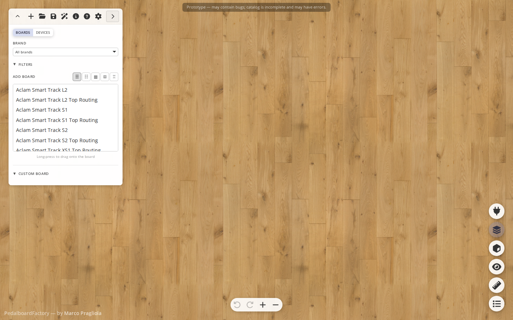
*App on first launch — empty canvas with catalog panel open.*

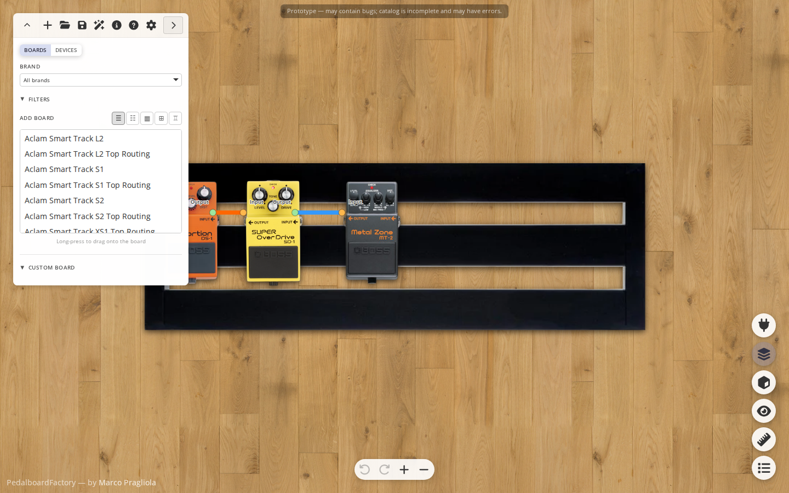
*Board with pedals and cables placed.*

The app has five main areas:
1. **Catalog panel** (left) - Browse/add boards and devices, filter, search, create custom items
2. **Canvas** (center) - Arrange objects and cables
3. **Side controls** (right) - Cables, 3D, view options, measurement tools, component list
4. **Bottom controls** (bottom-right) - Undo/Redo, Zoom in/out
5. **Board menu** (top-left) - New, Load, Save, GPT, Info, Settings

---

## Catalog Panel

### Boards — list view
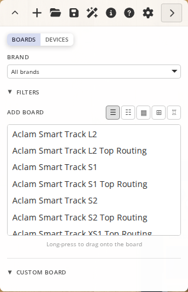

### Boards — thumbnail view
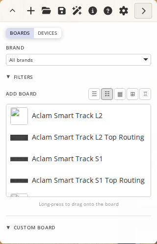

### Devices
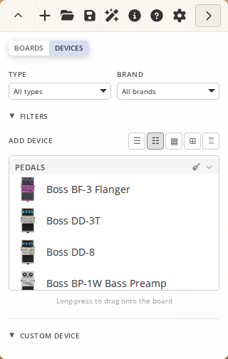

### Devices — filtered by type
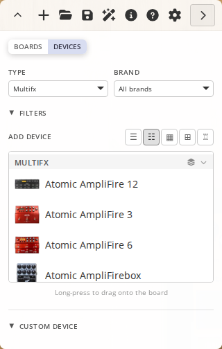

### Mode and unit
- Switch between **Boards** and **Devices**
- Switch units between **mm** and **in**

### Add items
- Use **Browse** views or list views to pick items
- Click an item to place it on the canvas
- Devices can be filtered by **Type**, **Brand**, and **Search**
- Boards can be filtered by **Brand**, **Search**, and **Size**

### Size filters
- Min/max **Width** and **Depth** sliders
- Values follow the selected unit (mm/in)
- **Reset filters** clears active filters

### Custom items

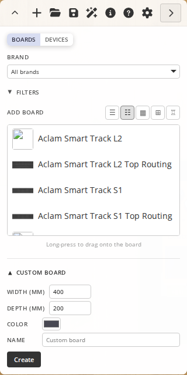

Create a custom board or device with:
- Width and depth
- Color
- Optional name

Custom items appear as colored rectangles (no catalog image).

---

## Canvas Basics

### Mouse
| Action | Result |
| --- | --- |
| Left drag on empty canvas | Pan |
| Middle drag | Pan (anywhere) |
| Left drag on object | Move object |
| Left click on object | Select object |
| Left click on empty area | Deselect |
| Wheel | Zoom in/out |

### Touch
- Single-finger drag on empty canvas: pan
- Single-finger drag on object: move object
- Pinch: zoom

### Object selection

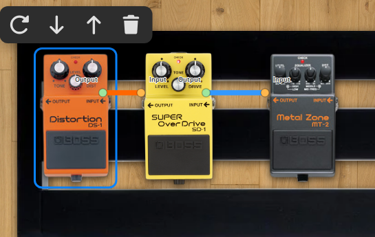
*Clicking an object shows the selection toolbar above it.*

When one object is selected:
- Toolbar appears above it: **Rotate 90 deg**, **Send to back**, **Bring to front**, **Delete**
- Info popup shows dimensions in current unit

Deleting an object also removes cables connected to it.

### X-ray mode

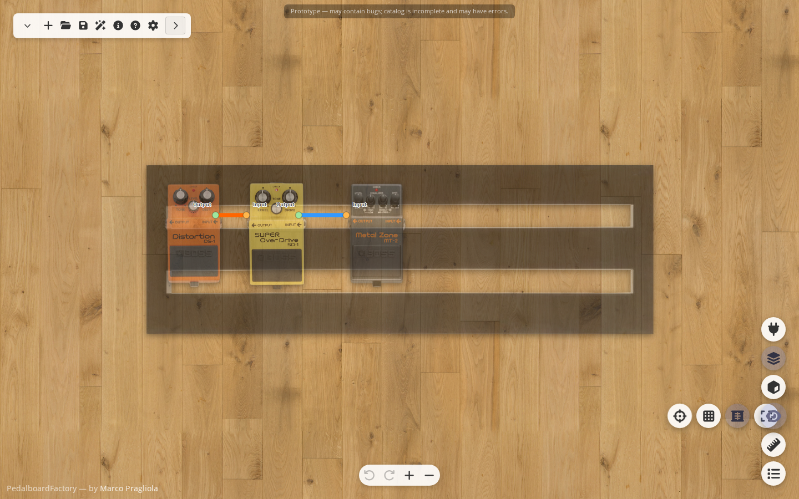
*X-ray makes all objects 50% transparent for easier wiring inspection.*

### Grid

*1mm grid overlay — toggle via View options in the side controls.*

---

## Cables

### Enter cable draw mode

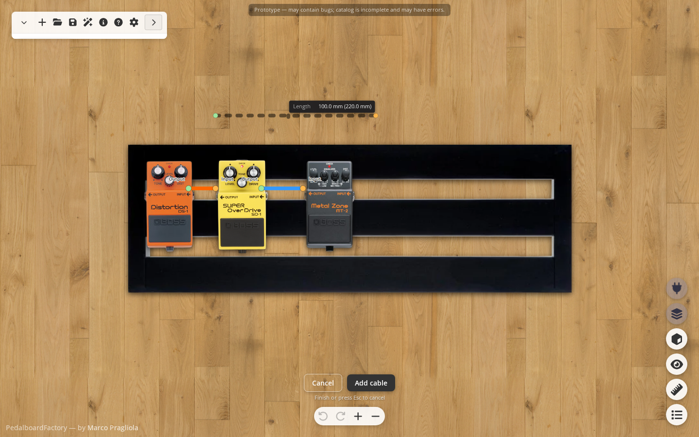
*Cable draw mode: click to add points, dashed line shows cable preview from last point to cursor.*

Click **Add cable** (plug icon) in side controls.

### Draw a cable
- Click/tap to add points
- Double-click/double-tap to finish current cable and open the add modal
- Click **Add cable** button (or press **Enter**) to finish current cable and open the modal
- Press **Esc** or click **Cancel** to discard in-progress cable

Modifiers while drawing:
- Hold **Shift**: disable snap
- Hold **Ctrl**: constrain to 45 deg directions

### Add/Edit cable modal

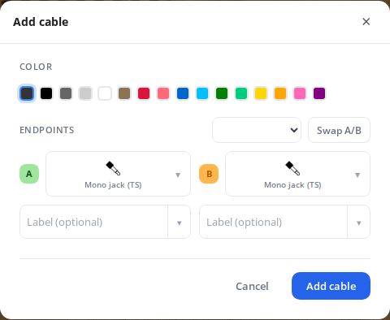

The modal lets you define cable appearance and endpoints:
- **Color** swatch picker
- **Template** dropdown (blank option + presets)
- **Swap A/B** button (swaps connector types and labels)
- Endpoint **A** and **B** side-by-side:
  - Connector type picker
  - Optional connector label

Built-in templates:
- **Mono jack** (TS male -> TS male)
- **Stereo jack** (TRS male -> TRS male)
- **XLR** (XLR male -> XLR female)

### Edit existing cables on canvas

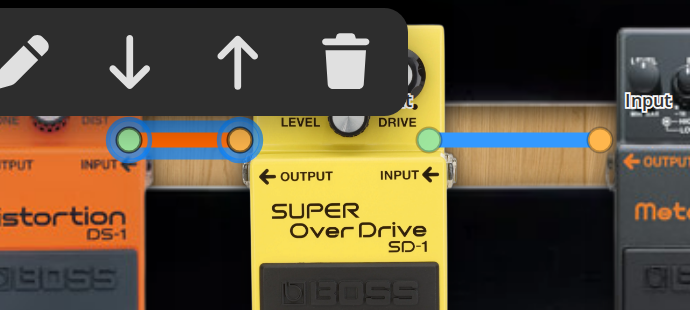
*Clicking a cable shows its toolbar: Edit, Send to back, Bring to front, Delete.*

Select a cable to show its cable toolbar:
- **Edit cable**
- **Send to back**
- **Bring to front**
- **Delete**

Vertex editing on selected cable:
- **Drag a vertex handle**: move vertex
- **Double-click / double-tap on a cable segment**: insert vertex
- **Long-press on a middle vertex**: remove vertex

Endpoints are color-coded:
- **A**: light green
- **B**: light orange

### Connector labels and icons on canvas

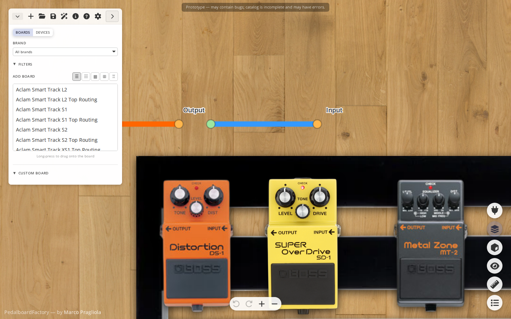
*Connector icons and labels displayed at each cable endpoint.*

If a connector label is set, the canvas shows:
- Label text
- Connector icon under the text

Placement is compensated using label+icon bounds so spacing from terminal points stays consistent at any angle.

### Cable visibility

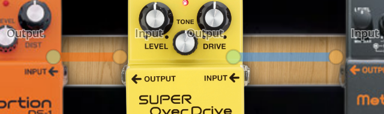
*Cables dimmed — useful for focusing on object placement.*

Cycle cable visibility with **Cables: On/Dim/Off** in the side controls.

---

## Side Controls

### Collapsed

### Expanded (all groups open)
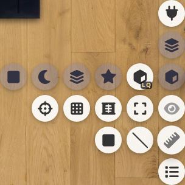

### Cable and visibility
- **Add cable**: toggle cable draw mode
- **Cables: On/Dim/Off**: cycle cable visibility

### 3D tools

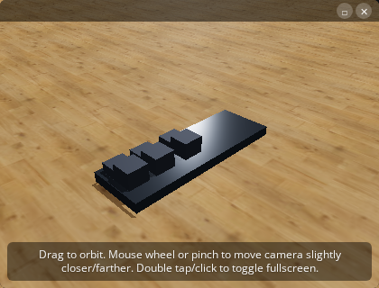
*High-quality 3D view with floor, shadows and specular highlights.*

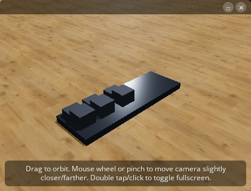
*Low-resource 3D mode for slower hardware.*

- **3D view**: open/close mini 3D overlay
- Secondary 3D toggles:
  - **3D floor**
  - **3D shadows**
  - **3D bump detail**
  - **3D specular**
  - **3D quality** (HQ / LQ toggle)

Inside the 3D overlay:
- Drag: orbit camera
- Wheel or pinch: adjust camera distance
- Double-click/double-tap: toggle fullscreen

### View tools
- **Center view**
- **Toggle grid**
- **X-ray** (object transparency)
- **Fullscreen**

### Measurement tools

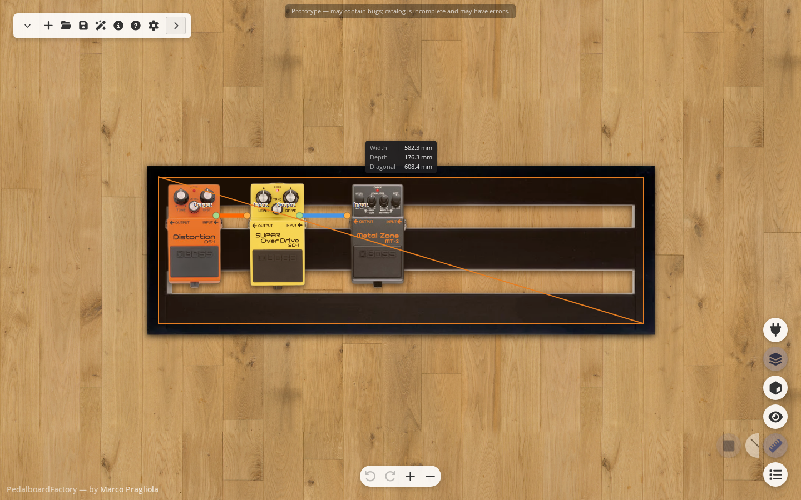
*Rectangle ruler: drag to measure width, depth and diagonal.*

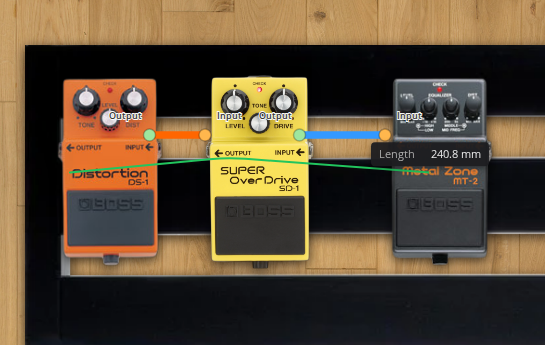
*Polyline ruler: click to add points, shows total length.*

- **Ruler** (rectangle): width/depth/diagonal
- **Line ruler** (polyline): total length

### Component list

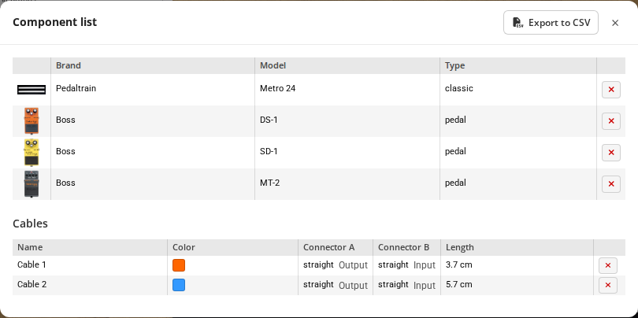

Opens the component/cable table modal.

---

## Component List Modal

Contains two sections:
1. **Components** table
2. **Cables** table

Features:
- Remove components or cables
- Double-click a row to select and focus that object/cable on canvas
- Export both tables to **CSV**

Cable table includes connector A/B info and measured cable length.

---

## Settings

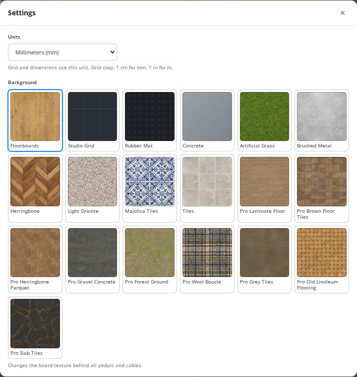

Access via **Board menu → Settings**. Configure canvas background and other preferences.

---

## GPT Price Prompt

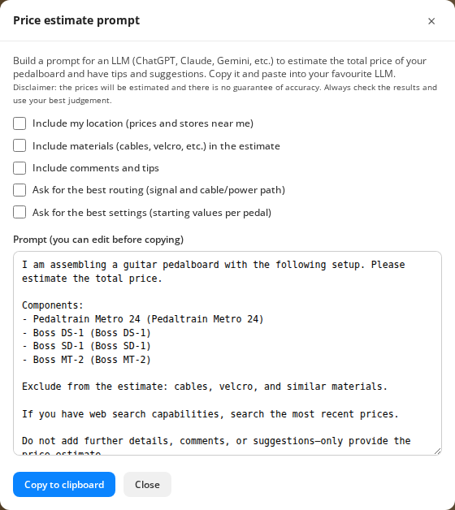

Open from **Board menu → GPT**.
Builds a prompt for ChatGPT/Claude/Gemini with optional flags:
- Include location (manual or browser location)
- Include materials (cables, velcro, etc.)
- Include comments and tips

You can edit the generated prompt and copy it to clipboard.

---

## File Operations

### New

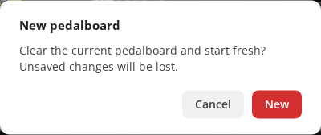
*Confirmation dialog before clearing the current board.*

Clears current board (with confirmation).

### Load
Load a saved `.json` layout.

### Save
Download current layout as JSON (objects, cables, view state).

---

## Keyboard Shortcuts

| Shortcut | Action |
| --- | --- |
| Ctrl+Z / Cmd+Z | Undo |
| Ctrl+Y or Ctrl+Shift+Z / Cmd+Shift+Z | Redo |
| Esc | Exit ruler/line ruler/cable drawing or close pending cable modal |
| Enter | In cable draw mode, finish and open Add cable modal |

---

## Auto-Save

Board state is auto-saved to browser local storage, including:
- Objects
- Cables
- Zoom/pan/view options
- Unit
- History state

---

## About

Use **Info** in Board menu for app info and disclaimers.

---

_All brands and product names are property of their respective owners. Data can contain errors; verify before
purchasing or relying on measurements._
